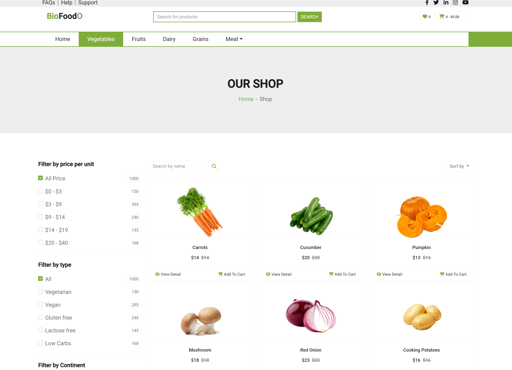
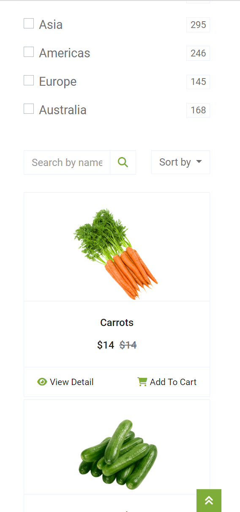
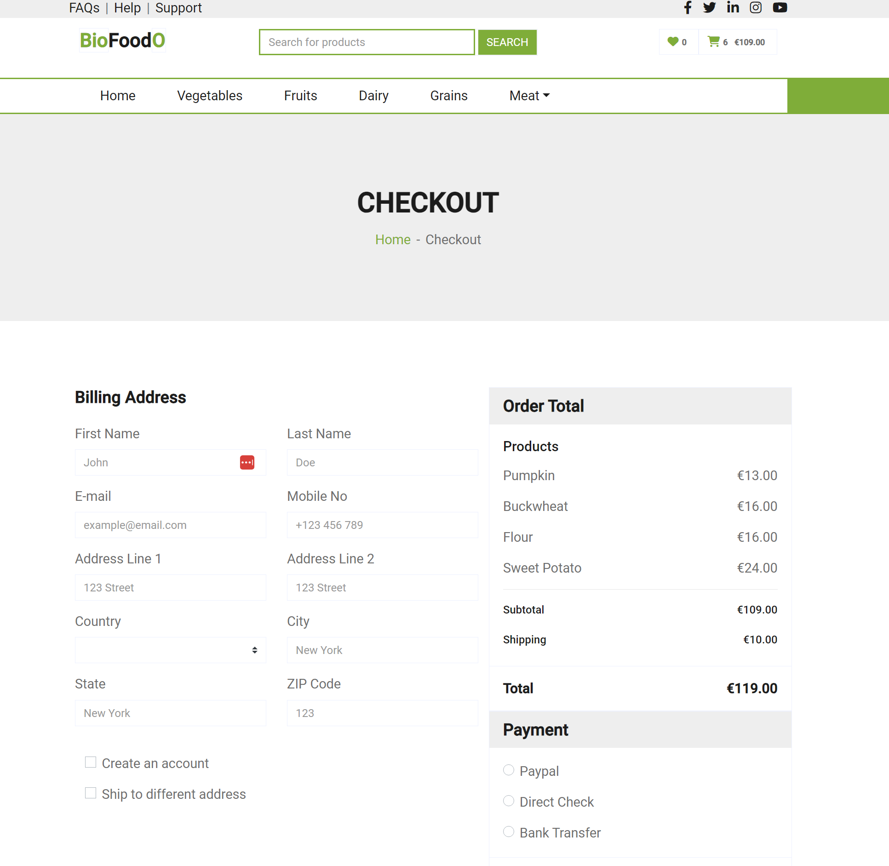
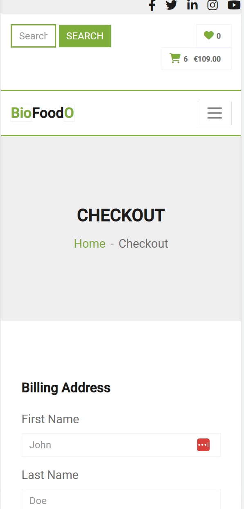
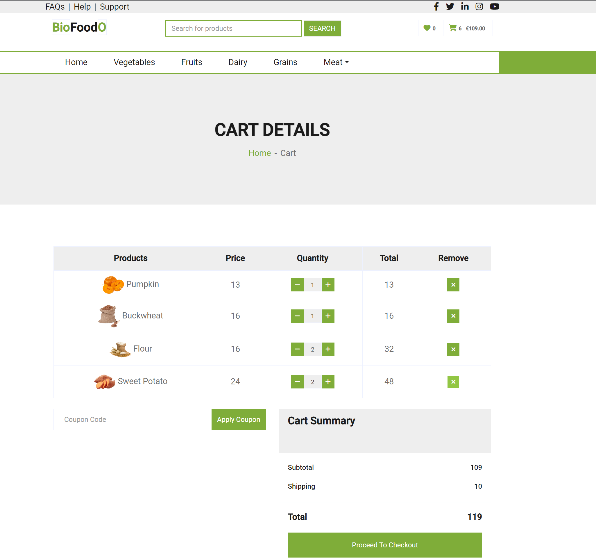
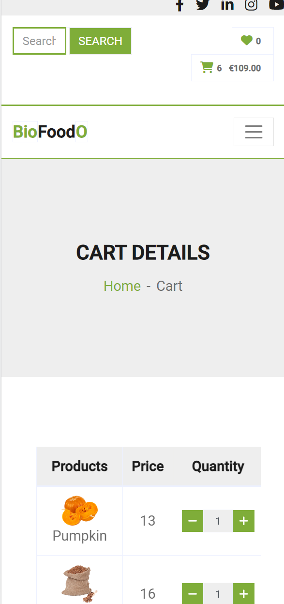

# Ecommerce Website

live version of progress:

plan:


A fullstack Ecommerce website (still under construction), current features:
  * Spring Boot JPA for products list, product categories and orders
  * Spring REST
  * Angular Front end
  * PostgreSQL

&emsp;
&emsp;**+**&emsp;
&emsp;**+**

## Interfaces
|| Web | Mobile |
|:--|:-----:|-----:|
|List|  |  |
|New List|  |  |
|Update List|   |   |
|Task View|||

## Create Database Tables

Run the database script from sql_scripts/ to generate the postgreSQL tables for the application and add data


## Run Back end

using maven and spring boot:

```bash
mvn spring-boot:run
```
or generating manually the jar by building the project with mave3n:

```bash
mvn clean install
```

and then executing the jar from the home project directory

```bash
java -jar .\target\TaskManager-0.0.1-SNAPSHOT.jar
```

or using Docker:

```bash
docker build -t ecommerceBackImg .
docker run --name ecom ecommerceBackImg
```

## Run Front end

- install angular and npm in the front-end directory
- install dependencies:
```bash
bootstrap@4.4.1
@angular/material@14
```
The app will be run at localhost:4200
navigate to front-end root directory and type.

```bash
ng serve
```
